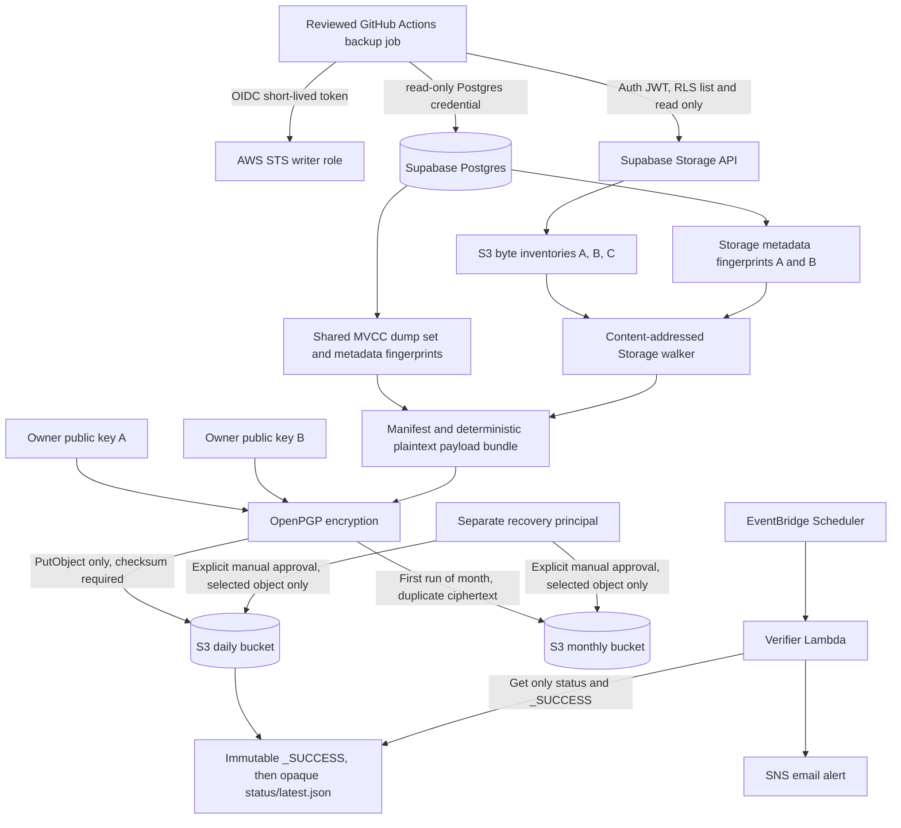

# Off-site Backup Implementation Plan

> **For agentic workers:** REQUIRED SUB-SKILL: Use superpowers:subagent-driven-development or superpowers:executing-plans to implement this plan task-by-task. Steps use checkbox (`- [ ]`) syntax for tracking.

**Goal:** Build an automated, encrypted, off-site backup of the Supabase Database and Storage bytes for `neural-whisper-web`, without PITR and without changing the Supabase Free plan.

**Architecture:** A reviewed GitHub Actions job reads Production through dedicated read-only credentials, captures a consistency-bounded logical database snapshot, separates S3 byte inventory from Database Storage metadata, stores Storage bytes by SHA-256 content address, and encrypts a manifest plus deterministic plaintext payload bundle to two owner-held OpenPGP public keys. Upload results exist only in immutable success and latest-status records. A separate destination-native watchdog checks only opaque status objects. No schedule is enabled until a complete isolated restore proves exact Database values and Storage bytes.

**Tech Stack:** Node.js 22.23.2, Supabase CLI 2.116.0 for verified command behavior and `db diff`, PostgreSQL client 17.11, GnuPG 2.5.21, zstd 1.5.7, AWS S3, AWS IAM OIDC, EventBridge Scheduler, Lambda, SNS, GitHub Actions.

---

## Planning status and hard boundaries

This document is a plan only. It does not authorize or perform any repository creation, workflow creation, credential creation, Supabase role or policy creation, Production connection, dump, Storage download, destination upload, purchase, branch, commit, pull request, migration, RLS change, secret creation, or Notion change.

Owner decisions already fixed:

- Supabase remains on Free.
- No Supabase Pro upgrade.
- No PITR.
- No purchase or payment method is authorized now.
- Database and Storage bytes both require automated off-site coverage.
- The supplied Production baseline before creation of the dedicated backup user is 63 migrations, 25 Auth users, four Storage buckets, and 14 Storage objects. Therefore the first post-creation Auth observation is expected to contain 26 users if no unrelated business change occurs. These values are planning inputs, not live-verified facts and not permanent restore constants.
- The repository contains exactly 63 local migration files as of 2026-08-29.

Hard conclusion:

- AWS S3 is the recommended target because it is the only compared option that satisfies GitHub OIDC, exact write-only IAM, versioning, prefix/object immutability, strong server-side checksum validation, independent native monitoring, and separate writer, verifier, and recovery identities.
- AWS Free Plan ends after six months or when credits are exhausted, whichever happens first. The account then closes automatically, access to resources and data is lost, and AWS permanently deletes the account and content after 90 days unless the account is upgraded to a Paid Plan. A twelve-month retention design therefore requires a future approval to pay or a completed migration before the Free Plan ends. The 90-day post-closure period is an account-recovery grace period, not a backup or retention mechanism.
- Cloudflare R2 has a recurring 10 GB free tier and prefix locks, but its documented object token permissions are read-only or read-and-write. It does not provide the required write-only target principal, and S3 bucket versioning APIs are not implemented.
- Backblaze B2 can start without a billing method and includes 10 GB, but it has no native GitHub OIDC. Its `writeFiles` capability also includes native hide operations, so it is not equivalent to strict `PutObject` without delete-like mutation.
- Under the current no-purchase decision, no provider is approved for implementation. Code work remains blocked until the owner approves AWS account creation, any payment verification, the selected region, and the post-Free-Plan disposition. This is an approval gate, not an invitation to proceed now.

## 1. Design decision

### Selected models

| Area | Selected model | Reason | Remaining production change |
|---|---|---|---|
| Database | Dedicated `LOGIN`, read-only, `BYPASSRLS` backup role with membership in `pg_read_all_data`, connection limit 1, and no ownership or write privileges | Limits a stolen credential to disclosure and read load. It can cover RLS-protected rows without becoming `postgres` | Create role, grant membership, set password, verify permissions, and later rotate or drop it |
| Storage source | Dedicated Supabase Auth user whose JWT is restricted by operation-aware `SELECT` policies to `object.list` and authenticated object reads for the approved four buckets | Session JWT honors RLS. The key cannot upload, update, copy, move, or delete objects | Create user and narrow policies. Each run necessarily creates an Auth session row |
| Destination | AWS S3 in `eu-central-1`, subject to owner data-residency approval | Outside source region `eu-north-1`, exact IAM, OIDC, versioning, Object Lock, checksums, lifecycle, EventBridge, Lambda, SNS | Create AWS account/resources and accept billing implications |
| Encryption | One bundle encrypted to two verified owner public keys | No private key exists in GitHub, AWS, the runner, or the destination | Owners must approve fingerprints and prove offline decryption |
| Consistency | Shared PostgreSQL exported snapshot for the four `pg_dump` files, wrapped by role, schema, migration, and auth/storage-diff fingerprints | Makes schema, application data, Auth data, Storage metadata, and migration history share one MVCC snapshot | Direct PostgreSQL 17 commands must reproduce reviewed CLI 2.116.0 filters because the CLI exposes no `--snapshot` flag |

### Explicit non-goals

- No physical backup, WAL archive, PITR, or point-in-time cross-service transaction.
- No backup through GitHub Artifacts, Git, chat, an unencrypted personal computer, or a developer laptop directory.
- No automated restore into Production.
- No destination-side server encryption key is relied on for confidentiality. Client-side OpenPGP encryption is mandatory. S3 default SSE-S3 remains defense in depth only.
- No promise that Database rows and Storage bytes are jointly atomic.

## 2. Architecture diagram



Trust boundaries:

- Production credentials cross only into the ephemeral backup job.
- AWS writer credentials are short-lived OIDC credentials and cannot read or delete destination objects.
- The verifier has no Production credential and cannot read encrypted snapshots.
- Recovery credentials are absent from scheduled jobs.
- Private decryption keys remain offline with authorized recovery persons.

## 3. Threat model

### Protected assets

- Database schema and data, including PII, Auth identities, Auth password hashes, orders, payments, entitlements, and admin roles.
- Storage metadata and object bytes.
- OpenPGP private keys and recovery capability.
- Source credentials, destination IAM, workflow integrity, manifests, and retention evidence.

### Threat actors and failure modes

| Threat | Primary control | Detection | Residual risk |
|---|---|---|---|
| Malicious workflow change exfiltrates Production credentials | Owner-only backup repository, default-branch OIDC condition, full-SHA Actions, no secrets in PR jobs, reviewed container digest | Workflow diff review, AWS CloudTrail, unexpected outbound-host test failure | GitHub Free cannot enforce protected branches or CODEOWNERS on a private repository. Owner account compromise remains critical |
| Stolen Database credential | Read-only role, no ownership, no write privileges, connection limit 1, rotation runbook | Database connection audit and unexpected query alert where available | `BYPASSRLS` exposes all backed-up rows and password hashes |
| Stolen Storage credential | Dedicated Auth user, exact bucket and operation-aware policies, short-lived JWT | Auth session review and denied mutation tests | Stored password can create new short-lived sessions until rotated. Login changes `auth.sessions` |
| Backup session survives a run or cleanup fails | Pre-login session preflight, one-session-at-a-time latch, explicit global sign-out on success and cleanup paths, session-row verification, alert, and credential revocation procedure | Any sign-out error, remaining `auth.sessions` row, cleanup interruption, or unacknowledged cleanup incident blocks the next login | A revoked access token remains usable until its JWT expiry unless the receiving service also validates `session_id`; Free does not provide configurable time-box, inactivity, or single-session controls |
| Compromised destination writer | OIDC, `PutObject` and multipart abort only, exact prefixes, no get/list/delete/config permissions | CloudTrail write data events and missing freshness | Writer can upload false or junk versions within approved prefixes. It cannot erase locked versions |
| Target administrator compromise | S3 Object Lock compliance mode and versioning | CloudTrail management events and configuration review | AWS account deletion and billing suspension remain outside object-level controls |
| Source changes during backup | Shared DB snapshot, A/B metadata hashes, Storage A/B/C inventories, conditional reads | Snapshot status becomes `INCONSISTENT`, no `_SUCCESS` | No cross-service atomic transaction exists |
| Pagination race or hostile key | S3 `ListObjectsV2`, continuation tokens, monotonic ordering, duplicate detection, content-addressed local names | A/B/C mismatch and walker invariant failures | A change that begins and ends between observations can escape detection |
| Partial or corrupted transfer | Source and local byte counts, ETag where meaningful, local SHA-256, precomputed S3 checksum, multipart part checksums, full-object checksum, and expected multipart object size | Upload rejection, success-record verification, restore gate | Source ETag is not guaranteed to be a full-content checksum. S3 upload responses do not report the received object length |
| Private key loss | Two owner recipients, offline decryption test, custody register, rotation overlap | Quarterly offline test | Multiple OpenPGP recipients are 1-of-2, not 2-of-2. Compromise of either private key permits decryption |
| Quota, billing, or scheduler exhaustion | Capacity thresholds, AWS budget alerts, GitHub minutes budget, external watchdog, and a dated month-4 commercial decision | Email alert and stale `_SUCCESS` | Free Plan expiry closes the account and removes access unless paid continuation or migration completes first. The 90-day post-closure period is not usable retention |

## 4. Credential model

### Database alternatives

| Question | Primary `postgres` connection | Dedicated read-only role | Official temporary access |
|---|---|---|---|
| `roles.sql` | Yes, including CLI 2.116.0 | Yes with direct `pg_dumpall --roles-only --no-role-passwords`, subject to a restore acceptance test. CLI 2.116.0 itself fails because it adds `--role postgres` | Yes if the temporary identity may assume `postgres`. With a read-only assumed role, use direct `pg_dumpall` |
| `schema.sql` | Yes | Yes with direct `pg_dump` and catalog access | Depends on assumed role |
| Read `public`, `auth`, `storage`, `supabase_migrations` | Yes | Yes through `pg_read_all_data` plus `BYPASSRLS` | Depends on assumed role |
| Ownership or extra privilege | CLI requires the ability to `SET ROLE postgres`. Plain `pg_dump` needs schema usage and read access to all dumped tables and sequences. Complete data behind RLS requires `BYPASSRLS`, or `row_security=off` causes a fail rather than silent omission | Requires `LOGIN`, `BYPASSRLS`, `pg_read_all_data`, `CONNECT`, and successful access tests. It receives no ownership, create, write, role-admin, replication, or file-server privilege | Enabling temporary access requires enforced SSL and a supported Postgres build. The mapped role retains its normal permissions |
| Theft impact | Full database takeover, including mutation and role administration | Read and exfiltrate all database backup content, cause read load, no intended mutation | Bounded by token expiry, IP restriction, and assumed role. Assuming `postgres` still permits full takeover during validity |
| Future Production change | None if existing password is used | Create and grant one role | Enable temporary access, configure platform user mapping, expiry, and CIDR restrictions |
| Revocation and rotation | Rotate project database password. This can disrupt every external client using it | `ALTER ROLE ... PASSWORD`, terminate sessions, then `DROP ROLE` when retired | Delete or expire PAT, remove mapping, disable JIT, and terminate sessions |
| One credential or split | One is enough but excessively privileged | One dedicated role is enough for role, schema, and data exports after the acceptance test | One mapped role is enough. Splitting metadata and data adds failure modes without materially reducing disclosure because both contain sensitive structure or rows |

Database recommendation:

- Use one dedicated database backup role.
- Set `row_security=off` in every dump session. This does not bypass RLS. It forces failure if the role lacks `BYPASSRLS`, preventing a silently incomplete backup.
- Do not grant membership in `postgres`, ownership, `CREATEROLE`, `CREATEDB`, `SUPERUSER`, `REPLICATION`, `pg_read_server_files`, or any write privilege.
- Do not use the primary `postgres` password in unattended automation.
- Reserve temporary access mapped to `postgres` for a separately approved, time-bounded manual recovery operation, not the scheduled backup.

CLI 2.116.0 constraint:

- Verified help and dry-run output show that schema, data, and role modes all inject `--role "postgres"`.
- The implementation must invoke PostgreSQL 17.11 tools directly for the shared-snapshot path and reproduce the reviewed CLI filters exactly.
- A contract test must compare generated commands and exclusions against committed fixtures captured from Supabase CLI 2.116.0 dry-run. Any future CLI upgrade requires a deliberate fixture review.

### Storage alternatives

| Question | Supabase service role or secret key | Supabase S3 access keys | Dedicated Auth user JWT |
|---|---|---|---|
| RLS | Bypasses RLS | Full S3 access across all buckets and bypasses RLS | Honors RLS |
| List and read only | Client code can limit itself, credential cannot | No. Credential permits all S3 operations across all buckets | Yes, with operation-aware `SELECT` policies |
| Theft impact | Broad API and database data access under `service_role` | Read, write, copy, move, and delete all Storage objects | List and read only the approved bucket set until password or session revocation |
| Future Production change | None if key already exists | Enable S3 and create access keys | Create Auth user and exact RLS policies |
| Rotation | Rotate secret or legacy key, potentially affecting other services | Revoke and regenerate S3 access keys | Change password, global sign-out, remove policies, or delete user. Existing JWT remains valid until expiry |

Storage recommendation:

- Use a dedicated Auth user and obtain a short-lived JWT at the beginning of each run.
- Before requesting a JWT, query the snapshot-independent current session state for the dedicated user's stable Auth ID. If any session exists, or if a previous sign-out or cleanup incident remains unacknowledged, fail closed and create no new session. The incident latch is cleared only after an operator proves revocation or cleanup and records the evidence.
- Use the Supabase S3-compatible endpoint with the JWT as a session token so traversal uses flat `ListObjectsV2` pagination rather than recursive offset pagination.
- Permit only `object.list` and `storage.object.get_authenticated` on `storage.objects`, restricted to the owner-approved four bucket IDs and the dedicated `auth.uid()`.
- Do not grant `INSERT`, `UPDATE`, or `DELETE` on `storage.objects`.
- The database preflight supplies the exact bucket allowlist, so the Storage identity does not need bucket-administration access.
- Accept and document one unavoidable mutation: password login creates an `auth.sessions` row. Supabase documents that sessions last indefinitely by default and that configurable time-box, inactivity, and single-session limits require Pro. The Free-plan design must never assume that expiry or background cleanup will remove the session.
- Invoke explicit global sign-out after every run, including a successful run, then verify that the run's `session_id` no longer exists in `auth.sessions`. Register the same idempotent cleanup attempt for normal process exit, `EXIT`, `SIGINT`, `SIGTERM`, timeout, and every failure path. Cleanup never changes a failed backup into a successful one.
- Any sign-out error, interrupted cleanup, or remaining session produces an alert and sets the no-new-session incident latch. Do not log in again until an operator has revoked the session or credential, verified the session state, and cleared the incident with recorded evidence. Because an issued JWT can remain valid until `exp` after sign-out, revocation evidence includes its expiry bound or downstream `session_id` validation where immediate invalidation is required.
- The backup performs no application-data, Storage-object, Storage-metadata, schema, policy, or configuration mutation. If the owner defines any Auth session mutation as forbidden, this model is impossible and the design must return for a credential decision.

## 5. Database coverage

### Verified CLI 2.116.0 behavior

`schema.sql`:

- Schema only. No table rows and no migration history rows.
- Includes application schemas that are not in the internal exclusion list, including `public` and any owner-created custom schema.
- Excludes `information_schema`, `pg_*`, `_analytics`, `_realtime`, `_supavisor`, `auth`, `etl`, `extensions`, `pgbouncer`, `realtime`, `storage`, `supabase_functions`, `supabase_migrations`, `cron`, `dbdev`, `graphql`, `graphql_public`, `net`, `pgmq`, `pgsodium`, `pgsodium_masks`, `pgtle`, `repack`, `tiger`, `tiger_data`, `timescaledb_*`, `_timescaledb_*`, `topology`, and `vault`.
- Includes application tables, views, sequences, routines, triggers, constraints, indexes, grants, RLS enablement, and policies in included schemas, subject to CLI filters for managed objects and event triggers.

`data.sql`:

- Data only, with all schemas included except `information_schema`, `pg_*`, `graphql`, `graphql_public`, `pgsodium`, `pgsodium_masks`, `pgtle`, `repack`, `tiger`, `tiger_data`, `timescaledb_*`, `_timescaledb_*`, `topology`, `vault`, `etl`, `extensions`, `pgbouncer`, `realtime`, `supabase_migrations`, `_analytics`, `_realtime`, and `_supavisor`.
- Includes `public` rows.
- Includes Auth rows, including `auth.users`, `auth.identities`, and password hashes, except `auth.schema_migrations`.
- Includes Storage metadata, including `storage.buckets` and `storage.objects`, except `storage.migrations`.
- Excludes `supabase_functions.migrations`.
- Does not include object bytes. Storage bytes must be copied separately.
- Current official managed-project restore guidance excludes `storage.buckets_vectors` and `storage.vector_indexes`. Keep both exclusions for CLI 2.116.0. Before schedule activation, query both tables. If either has rows or vector buckets exist, mark coverage incomplete and block scheduling until a separate vector export and restore test exists.

`history_schema.sql` and `history_data.sql`:

- Required because the default schema and data paths exclude `supabase_migrations`.
- `history_schema.sql` recreates the migration-history schema objects.
- `history_data.sql` preserves the applied migration rows.
- The first restore must assert exactly 63 applied migrations and compare the ordered migration-version hash, not only the count.

`changes.sql`:

- Required. The default schema dump excludes `auth` and `storage`, while this repository contains custom Auth triggers and Storage RLS policies created outside the default included schemas.
- Generate it through the official `supabase db diff --db-url ... --schema auth,storage` flow against the reviewed local migration set.
- Generate canonical `changes_A.sql` before the shared dump and `changes_B.sql` after it. Strip only documented nondeterministic headers, then require byte-identical normalized content. Store one copy as `changes.sql` only when equal.
- Supabase documents known `db diff` gaps, including Storage bucket changes and publications. Bucket configuration is therefore also covered by `storage.buckets` data and explicit fingerprints. Publication state must be fingerprinted separately.

`roles.sql`:

- Must use `--no-role-passwords` and `--no-comments`.
- Contains role names, attributes, settings, and memberships after reserved-role filtering. It can expose security topology and is classified sensitive.
- Contains no role password verifier by design. Login roles require new passwords after restore.

### Coverage proof

The manifest stores the following inside the encrypted bundle:

- Snapshot-bound Auth evidence: observed `auth.users` count, the complete sorted user-ID list, the dedicated backup-user ID and classification, per-row content hashes, and aggregate canonical content fingerprints for `auth.users`, `auth.identities`, and `auth.sessions`. The supplied pre-creation Production baseline is `25`; the first post-creation observation is expected to be `26` only if no unrelated business change occurred. Each accepted snapshot records its own expected count, identifier set, and fingerprints, and restore compares exactly to that snapshot rather than to `25` or `26`.
- Ordered migration versions, count, minimum, maximum, and SHA-256, with first-gate expectation `63`.
- Expected schema names and actual schema names.
- Full relation inventory by schema, name, kind, owner, RLS enabled, and forced-RLS status.
- Critical tables at minimum: `auth.users`, `auth.identities`, `auth.sessions`, `storage.buckets`, `storage.objects`, `supabase_migrations.schema_migrations`, `public.profiles`, `public.user_roles`, `public.orders`, `public.payments`, `public.payment_intents`, `public.products`, `public.products_courses`, `public.courses`, `public.modules`, `public.lessons`, `public.resources`, `public.user_progress`, `public.user_course_access`, and `public.entitlements`.
- Per-table exact row counts for all dumped ordinary and partitioned tables, plus an aggregate hash over sorted `schema.table=count` records. Counts are completeness evidence only and never satisfy the content restore gate.
- Schema fingerprint over sorted columns, types, nullability, defaults, constraints, indexes, sequences, views, materialized views, ownership, grants, and RLS flags.
- Extension inventory with name, version, and schema.
- Routine fingerprint over schema, identity arguments, result type, language, security mode, volatility, configuration, and definition hash.
- Trigger fingerprint over relation, trigger name, enabled mode, and definition hash.
- RLS policy fingerprint over schema, table, policy, permissive mode, roles, command, `USING`, and `WITH CHECK` expressions.
- Publication membership fingerprint.
- Role fingerprint excluding password fields.

A nonempty file is never sufficient proof. Any missing critical relation, count-query failure, RLS filtering error, unrecognized schema, or fingerprint-query error marks the snapshot `INCONSISTENT`.

### Canonical table-content fingerprints

Generate a content fingerprint for every dumped ordinary and partitioned table from the exported source snapshot, then regenerate it after restore. The generator is versioned as `table_fingerprint_version=1`; its source and restore implementations are the same reviewed executable and PostgreSQL major version.

Canonical contract:

- Discover columns from `pg_catalog` and encode them in physical `attnum` order. Prefix every table stream with schema name, table name, column name, stable qualified type name and type kind, typmod, qualified collation name, and nullability. Use OIDs only to resolve catalog entries at runtime; never fingerprint or compare numeric OIDs because they can differ after restore. A schema/type change therefore cannot masquerade as equal data.
- Encode each cell as `type-tag || null-tag || byte-length || value-bytes`. Lengths are unsigned 64-bit big-endian values. SQL `NULL` uses a distinct null tag and no value bytes; it can never collide with an empty string, JSON `null`, an empty array, or zero-length `bytea`.
- Set `client_encoding=UTF8`, `DateStyle=ISO, YMD`, `IntervalStyle=iso_8601`, `TimeZone=UTC`, `bytea_output=hex`, `extra_float_digits=3`, and `lc_numeric=C` in both environments before reading any row.
- Encode `timestamp with time zone` as UTC ISO 8601 with six fractional digits and an explicit `Z`; encode `timestamp without time zone`, `date`, `time`, and `interval` with fixed type-specific formats and explicit encodings for `infinity` and `-infinity`. Never apply a time zone to a timestamp without time zone.
- Encode `json` from its exact stored text converted to UTF-8, preserving whitespace, key order, duplicate keys, and numeric spelling. Encode `jsonb` from PostgreSQL 17 canonical text output converted to UTF-8, preserving its stored semantic value while accepting that `jsonb` itself does not preserve input whitespace, key order, or duplicate keys.
- Encode `bytea` as lowercase hexadecimal over the exact octets.
- Encode arrays with rank, every dimension's lower bound and length, element type identity, element storage order, explicit element-null tags, and recursively encoded elements. This distinguishes null arrays, empty arrays, null elements, dimensions, and non-default lower bounds.
- Encode `real` and `double precision` using their exact IEEE binary bytes in network order, including signed zero, infinities, and NaN representation. Do not parse them through JavaScript numbers. Encode `numeric` from normalized PostgreSQL text with explicit `NaN`, `Infinity`, and `-Infinity` cases.
- Encode domains with both the domain type identity and the canonical encoding of the base value. Encode enums by qualified type and label. Any unrecognized base, range, multirange, composite, extension, or user-defined type blocks the snapshot until a reviewed canonical encoder and round-trip fixture exists.
- Hash each complete canonical row with SHA-256. For a table with a primary key, sort by the length-prefixed canonical primary-key bytes, then the full canonical row bytes. For a table without a primary key, sort by the full canonical row bytes. Preserve duplicate rows, so multiplicity changes the stream and the count.
- Read each physical relation with `ONLY` so partition parents and children are not double-counted. Stream the externally sorted rows into a table SHA-256 containing the table header, row count, and every length-prefixed canonical row. Record `schema`, `table`, `fingerprint_version`, `row_count`, `content_sha256`, primary-key column list or `null`, and the column-encoder contract hash in `db/fingerprints.json`.
- Compare the complete sorted set of table records between the source snapshot and the immediate post-dump Database restore. This exact phase includes the original `storage.buckets` and `storage.objects` rows and proves that the logical dump was restored without change. A missing or extra table, missing or extra row, different duplicate multiplicity, changed column contract, or any changed cell value fails the restore gate. Row counts may aid diagnosis but cannot override a content-hash mismatch. Later supported Storage API calls are a separate semantic restore phase and are evaluated against the Storage restore contract and transformation ledger, not by pretending that provider-managed metadata cannot change.

## 6. Consistency model

### Database consistency

The selected model is shared snapshot option A, with an explicit non-atomic envelope.

1. Record `db_metadata_A` and UTC timestamp.
2. Generate normalized `changes_A.sql`.
3. Open a control connection with `BEGIN ISOLATION LEVEL REPEATABLE READ READ ONLY`.
4. Export the snapshot with `pg_export_snapshot()` and keep the control transaction open.
5. Run `schema.sql`, `data.sql`, `history_schema.sql`, and `history_data.sql` sequentially with PostgreSQL 17.11 `pg_dump --snapshot=<exported-id>` and `row_security=off`. In an imported-snapshot connection, generate `db/fingerprints.json`, including every canonical table-content fingerprint and the authoritative `storage.objects` and `storage.buckets` metadata fingerprint.
6. Generate `roles.sql` with `pg_dumpall --roles-only --no-role-passwords --no-comments` and apply the reviewed Supabase reserved-role filters.
7. Commit the control transaction only after all four snapshot-bound dumps and `db/fingerprints.json` finish.
8. Generate normalized `changes_B.sql`.
9. Record `db_metadata_B` and UTC timestamp.
10. Require matching ordered migration hash, schema fingerprint, role fingerprint, auth/storage custom-diff fingerprint, extension fingerprint, routine fingerprint, trigger fingerprint, RLS-policy fingerprint, and publication fingerprint.

Transactional claims:

- The four `pg_dump` files and `db/fingerprints.json` share one MVCC snapshot and are transactionally consistent with each other for catalog-visible schema and rows.
- Each dump also has its own internal consistency guarantee from PostgreSQL.
- `roles.sql` is cluster-global and is not tied to the exported database snapshot.
- `changes.sql` is generated by the Supabase diff flow and is not tied to the exported snapshot.
- Fingerprints bound role and auth/storage changes before and after, but cannot prove that a DDL change occurred and was fully reversed between observations.
- No output may be labeled atomic. The status vocabulary is `CONSISTENT_WITHIN_BOUNDS`, `INCONSISTENT`, or `FAILED`.

DDL and migration controls:

- Compare ordered `supabase_migrations.schema_migrations` hashes before and after.
- Compare full schema, routine, trigger, RLS, extension, and publication fingerprints before and after.
- Record `started_at`, each phase start and end, exported snapshot time, each dump start and end, and `completed_at` in UTC with monotonic durations.
- Mark `INCONSISTENT` on any fingerprint difference, migration difference, dump failure, lock timeout, role-filter mismatch, auth/storage diff mismatch, or control-transaction loss.

Retry policy:

- No consistency failure is retried within the same run. The next scheduled run receives a new snapshot ID and starts from Storage inventory A.
- Idempotent network calls may receive one retry only for timeout, connection reset, HTTP 429, or HTTP 5xx, with bounded exponential backoff and jitter.
- Authentication, authorization, checksum, validation, schema, count, and fingerprint failures receive no retry.
- Global job timeout is 30 minutes. The retry budget is included inside it.
- Infinite retry can conceal a continuously changing source, consume GitHub minutes, keep plaintext alive, and create an apparently fresh but unbounded snapshot. It is forbidden.

### Database and Storage ordering

Required orchestration:

1. S3 byte inventory A.
2. Database metadata fingerprint A, including `storage.objects` and `storage.buckets`.
3. Shared Database dump set and authoritative snapshot-bound Storage metadata fingerprint.
4. Database metadata fingerprint B, including `storage.objects` and `storage.buckets`.
5. S3 byte inventory B.
6. Require Database fingerprints A, snapshot-bound, and B to match, S3 byte inventories A and B to match, and both S3 inventories to join one-to-one with the snapshot-bound Database metadata. If any comparison fails, skip downloads, capture S3 byte inventory C for evidence, and fail inconsistent.
7. Download bytes with conditional `GetObject`, recording a download receipt for each key.
8. S3 byte inventory C.
9. Compare S3 byte inventories A, B, and C and reconcile every download receipt against them.
10. Create the deterministic plaintext payload bundle, calculate its size and SHA-256, then create the internal manifest that refers only to plaintext files and that payload bundle.
11. Encrypt the manifest and payload bundle, calculate local ciphertext SHA-256 and size, and upload the ciphertext.
12. Write immutable `_SUCCESS` with the local ciphertext facts and returned S3 checksum, ETag, and VersionId. Publish `status/latest.json` last, with the same ciphertext facts and the exact `_SUCCESS` key and VersionId.

If either Database metadata comparison fails, any S3 A/B/C comparison fails, any join is not one-to-one, or any download receipt disagrees:

- Do not create `_SUCCESS`.
- Do not publish `status/latest.json` as successful.
- Mark local status `INCONSISTENT`.
- Do not retry the snapshot in the same run.
- Securely clean local plaintext.
- Allow the next run to start a new snapshot.

Remaining limitation:

- PostgreSQL metadata and Storage object bytes have no shared transaction. Separate Database fingerprints, S3 byte inventories A/B/C, explicit joins, and conditional reads reduce the race window but cannot eliminate it.

## 7. Storage traversal

### Walker contract

- Source bucket IDs come from `storage.buckets` and must equal the owner-approved set of four. Known repository references include `blog-images`, `product-images`, and `lesson-content`. The fourth live bucket name must be approved during the credential preflight and committed only to protected configuration, not sent to monitoring.
- Use Supabase S3 session-token authentication backed by the dedicated Auth user's JWT.
- Use `ListObjectsV2` independently for every bucket, no delimiter, maximum supported page size, and continuation tokens until `IsTruncated=false`.
- Treat prefixes and folders as key syntax only. Do not recurse through pseudo-directories.
- Require strictly increasing keys within each bucket and reject duplicate keys or repeated continuation tokens.
- Canonically sort the final inventory regardless of page boundaries.
- An insertion or deletion between pages is detected by the later A/B/C comparison. The API listing itself is not represented as a snapshot.
- Test with at least 2,005 objects so the test crosses at least three 1,000-object pages.
- Include Unicode normalization edge cases, Hebrew, emoji, combining marks, spaces, `%`, leading `.`, repeated `/`, `..`, absolute-looking names, backslashes, control-character rejection, the same key in different buckets, and a zero-byte object.
- Pass object keys only to the signed SDK request. Never concatenate a source key into a local path or shell command.

### Two-layer Storage inventory

Layer 1, S3 byte inventory:

- Build only from the S3-compatible protocol. For each `ListObjectsV2` item record the request-context `bucket_id` plus the response's `Key`, `Size`, `ETag`, `LastModified`, `StorageClass`, and optional `ChecksumAlgorithm` and `ChecksumType` when actually returned.
- For each `GetObject`, separately record the request-context bucket and key plus the response `Content-Length`, `ETag`, `Last-Modified`, and any checksum fields actually returned. The local received-byte count and local SHA-256 are computed facts, not claimed S3 response fields.
- Do not place Supabase UUID, MIME type, `created_at`, `updated_at`, `last_accessed_at`, metadata, or source version in this layer. `ListObjectsV2` does not return those Supabase-specific fields, and Supabase does not support S3 object versioning.
- Normalize and sort by UTF-8 bytes of `bucket_id`, then opaque object key. Preserve ETag as an opaque string. Do not treat it as a whole-object checksum.

Layer 2, Database metadata fingerprint:

- Read the authoritative `storage.buckets` and `storage.objects` fingerprint through the exported Database snapshot into `db/fingerprints.json`. Also read direct fingerprints A and B outside the control snapshot to bound changes before and after; all three Database fingerprints must agree.
- For buckets, include at minimum `id`, `name`, `public`, `file_size_limit`, `allowed_mime_types`, `created_at`, and `updated_at`, plus every additional non-volatile column discovered from the actual schema.
- For objects, include at minimum UUID `id`, `bucket_id`, object key from `name`, MIME value from the documented metadata representation, cache-control, ownership fields, size, `created_at`, `updated_at`, `last_accessed_at` when the deployed schema contains it, complete `metadata` as canonical `jsonb`, and `version`, plus every additional non-volatile column discovered from the actual schema.
- Fingerprint all fields even when null. Do not exclude `last_accessed_at` merely because a read might affect it. The A/B fingerprint is captured before object downloads; a deployment where inventory reads themselves mutate a fingerprinted field is inconsistent and blocks scheduling until the behavior has a reviewed protocol.
- Preserve the complete original bucket and object rows, including UUIDs, timestamps, version, ownership, and all metadata, as encrypted source evidence. Evidence completeness does not imply that every internal field can or should be forced through the public Storage API during restore.

Cross-layer reconciliation:

- Join `storage.objects.bucket_id` to the request-context bucket ID and `storage.objects.name` to the exact S3 object key. Join `storage.buckets.id` to the same bucket ID.
- Require exactly one Database object row and one S3 byte row for every `(bucket_id, object_key)`, no unmatched rows in either direction, no duplicate pair, and no object referencing a missing bucket.
- Require Database metadata size, when present, to equal S3 `Size`, and reconcile MIME independently without inventing an S3 list field. A difference in ID, version, timestamps, metadata, bucket configuration, size, or mapping changes the Database fingerprint or join evidence and marks the run `INCONSISTENT`.

### Storage restore contract

Storage restore has two distinct proofs:

1. **Exact source evidence and Database restore.** The encrypted snapshot retains every original `storage.buckets` and `storage.objects` value and its canonical fingerprint. Immediately after the official logical Database restore, before any Storage API mutation, regenerate the canonical fingerprints and require exact equality with the source dump.
2. **Supported semantic Storage restore.** Restore or reconcile buckets and object bytes only through documented Supabase Storage, S3-compatible, or Management APIs. Treat the `storage` schema as read-only after the logical restore. Never issue direct `INSERT`, `UPDATE`, `DELETE`, or ad hoc corrective SQL against `storage.objects` or `storage.buckets` to force UUIDs, timestamps, version, ownership, or metadata.

This boundary follows the Storage schema documentation, which describes the schema as metadata-only and read-only for operations, and the April 2025 Supabase changelog restriction intended to protect managed Auth and Storage schemas. The official CLI/`psql` logical restore remains the exact Database phase; it is not authority for later corrective SQL against Storage internals.

The versioned contract classifies every source field before the first restore test:

- Semantic fields that must survive the API restore: bucket ID and name, complete supported bucket configuration including public/private state, file-size and MIME restrictions, exact object key, exact bytes and SHA-256, byte size, MIME/content type, cache-control, ownership when the supported API can preserve or assign it, and observed RLS behavior for authorized and unauthorized requests. If a documented API review and recorded restore test prove that arbitrary source ownership cannot be assigned, the contract may predeclare ownership as source-evidence-only for that API/version; it must still preserve the original owner in encrypted evidence and prove equivalent RLS behavior. Ownership is not silently reclassified as provider-managed.
- Provider-managed fields that may be regenerated only when official documentation or a recorded restore test proves there is no supported exact-preservation path: internal object UUID, operational `version`, `created_at`, `updated_at`, and `last_accessed_at`. A field is not provider-managed merely because exact restoration is inconvenient.
- Unclassified fields are fail-closed. A changed semantic field or byte fails the Restore Gate. A changed provider-managed field also fails unless that field and allowed transformation were declared in the contract before the restore began.
- If an official supported API is found that preserves any metadata field exactly, record the API, version, request and response evidence, add a behavioral proof, and reclassify that field as exact-preservation-required. Direct SQL against the Storage schema is never accepted as that proof.

The snapshot contains the versioned restore contract and encrypted source evidence. During a restore, create `storage/transformation-ledger.json`, then encrypt it to the same owner recipients as part of the restore-evidence bundle before retaining it. For each bucket and object, map the stable source locator and complete source metadata to the restored locator and metadata, state `preserved` or the predeclared provider-managed transformation for every field, cite the supporting documentation or restore-test evidence, and record the restored byte size and SHA-256. Canonically fingerprint the ledger. Missing mappings, unexplained differences, post hoc classifications, semantic differences, byte differences, or a provider-managed difference outside the predeclared contract fail the Restore Gate. Never retain or transmit the plaintext ledger outside the isolated restore workspace.

### Content-addressed bytes

- Stream each download into a random file beneath the isolated work directory while calculating SHA-256.
- Require the local received byte count to equal the S3 byte-inventory `Size` and `GetObject` HTTP `Content-Length` when present.
- Use conditional `If-Match` with the listed ETag when the endpoint supports it. Reject HTTP 412.
- Compare response ETag or checksum with inventory when meaningful. Do not treat multipart ETag as whole-file MD5.
- On success, atomically move the random file to `storage/blobs/<lowercase-sha256>`.
- If that hash already exists, compare size and hash and deduplicate. The encrypted manifest retains both logical mappings.
- A partial download, timeout, signal, disk-full error, short read, long read, hash mismatch, response-version mismatch, or rename failure invalidates the run.
- No object key, bucket name, business count, or project reference appears in destination object names, public status, logs, or monitor payloads.

Manifest object mapping fields:

```text
manifest_version
snapshot_id
bucket_id
object_key
object_id
source_version
size
mime_type
created_at
updated_at
last_accessed_at
source_etag
source_last_modified
blob_sha256
blob_relative_path
```

The mapping combines the separately sourced layers only after the explicit one-to-one reconciliation. The manifest is plaintext only inside the ephemeral work directory and is encrypted with the payload bundle.

## 8. Provider comparison

Facts must be rechecked against official pricing and feature pages at the approval date because pricing and free plans change.

| Capability | AWS S3 | Cloudflare R2 | Backblaze B2 |
|---|---|---|---|
| Free use | Eligible new customers receive $100 credits, can earn another $100, and the Free Plan ends after six months or credit exhaustion, whichever comes first. The account then closes automatically unless upgraded | 10 GB-month Standard, 1 million Class A, 10 million Class B monthly, free egress | First 10 GB free. Backblaze states no billing method is needed to start |
| Payment method | May be requested for new sign-up. Advanced sign-up requires a valid payment method | R2 is usage-based. A billing profile and primary payment method are required to purchase or enable paid services | Not required to begin. Charges can accrue after free limits if billing is enabled |
| After free allowance | Region-specific storage, requests, monitoring, and egress pricing. S3 Standard has no minimum charge | Standard $0.015/GB-month, Class A $4.50/million, Class B $0.36/million, egress free | $0.005/GB-month after 10 GB. Free egress up to three times average monthly storage, then $0.01/GB |
| GitHub OIDC | Native through AWS IAM and STS, with `aud` and `sub` trust conditions | No documented native trust of GitHub OIDC for R2 S3 access. Uses API tokens or temporary credentials derived from a parent secret | No native GitHub OIDC. Uses application keys |
| S3 compatibility | Native | Partial. `PutBucketVersioning` is not implemented | Compatible API with documented capability mapping |
| Versioning | Native S3 Versioning | No S3 bucket versioning API | Native file versions and lifecycle handling |
| Lifecycle | Prefix and tag rules | Prefix rules, Standard and Infrequent Access | Prefix lifecycle rules for versions |
| Immutability | S3 Object Lock, versioning required, governance or compliance mode | Prefix bucket locks, longest matching rule wins | Object Lock and default bucket retention |
| Audit | CloudTrail management events, paid object data events, or S3 server access logs | Free account audit logs cover configuration, not `GetObject` or `PutObject` data access | Bucket access logs are best effort and may be incomplete or duplicated |
| Region outside `eu-north-1` | Exact region selection, proposed `eu-central-1` | Location hint or jurisdiction, not an AWS-style exact region guarantee | Account region selected at creation, including US and EU options |
| Checksums | SHA-256 and other algorithms, server validation, full or composite multipart support | Full CRC64NVME and composite CRC/SHA support, multipart ETag behavior documented | Required SHA-1 for native single uploads, per-part SHA-1 for large files, optional whole-large-file SHA-1 |
| Multipart | Full support and abort permission separation | Supported, 5 MiB minimum nonfinal part, 10,000 parts | Supported through native and S3 APIs |
| Minimum billing | S3 Standard has no minimum charge. Archive classes have duration and size minimums | Standard has no duration minimum. Infrequent Access has 30 days. Billing units round up | No documented object-size minimum for standard B2 billing |
| Restore egress | Region-specific transfer pricing after AWS free transfer allowances | Free egress, IA retrieval charge applies | Free up to three times average monthly stored data, then paid |
| Separate writer and reader | Exact IAM actions and object ARNs | Read-only or read-and-write object token permissions. No documented write-only token | Separate keys and prefixes, but `writeFiles` includes native hide behavior |

## 9. Provider recommendation

Select AWS S3, conditionally.

Required future owner approval:

- AWS account creation and identity ownership.
- Any payment card verification or temporary hold.
- `eu-central-1` data residency and legal transfer review.
- A dated decision no later than month 4 to upgrade to AWS Paid Plan or complete a tested migration to another approved provider before the earlier of the six-month deadline and credit exhaustion.
- Cost budget and hard alerts.
- Creation of two private S3 buckets, one daily and one monthly, because bucket-default Object Lock provides stronger enforcement than trusting the writer to choose retention headers.

Do not start implementation if the owner requires a permanent zero-payment solution. R2 and B2 do not meet the exact target-principal requirements, so selecting either would require an explicit security exception and an updated plan.

Commercial continuity rule:

- Free Plan expiry automatically closes the account and removes access to resources and data. AWS retains content for 90 days before permanent deletion, but reopening or downloading during that period requires upgrading to a Paid Plan.
- The 90-day post-closure period is emergency account recovery only. It does not satisfy daily retention, annual retention, restore availability, monitoring, or off-site backup continuity and must not appear in any capacity or recovery calculation.
- Annual retention is approved only together with future paid operation or a funded, tested migration completed while the account remains open. Missing the month-4 decision or projected early credit exhaustion disables schedule activation and raises a critical governance failure.

## 10. Destination IAM

### Writer principal

Authentication:

- GitHub OIDC to a short-lived AWS role.
- Trust `aud=sts.amazonaws.com`.
- Restrict `sub` to the exact owner-only backup repository and exact default branch.
- Do not trust pull-request refs, forks, tags, arbitrary branches, or GitHub environments. GitHub Free private repositories cannot use environment protections.

Allowed target operations:

- `s3:PutObject` only on the approved `v1/daily/`, `v1/monthly/`, `v1/status/`, and snapshot-local `_SUCCESS` object ARNs in the appropriate buckets.
- `s3:AbortMultipartUpload` on those object ARNs.
- `s3:ListMultipartUploadParts` only if the selected SDK requires it for resumed multipart state. Prefer a fresh multipart upload that does not require list.
- No `s3:GetObject`, `s3:GetObjectAttributes`, `s3:ListBucket`, `s3:DeleteObject`, `s3:DeleteObjectVersion`, `s3:BypassGovernanceRetention`, bucket policy, lifecycle, versioning, retention, replication, ACL, or KMS administration permission.

Upload verification without `GetObject`:

- Before either upload mode, record the local ciphertext byte size and SHA-256. These are local expected facts and are never inferred from an S3 response.
- For single-part `PutObject`, send exact `Content-Length` and a precomputed supported checksum header. Require HTTP success and a returned checksum equal to the submitted value; capture returned checksum algorithm/value, ETag, and VersionId. The response `Content-Length`, when present, describes the response body and is not the number of object bytes S3 received.
- For multipart, choose a checksum algorithm that supports S3 `FULL_OBJECT` validation, preferably `CRC64NVME`; declare the algorithm and `FULL_OBJECT` type in `CreateMultipartUpload`, submit ordered part checksums, then send the precomputed full-object checksum and `x-amz-mp-object-size` expected total object size in `CompleteMultipartUpload`. A checksum mismatch must fail with `BadDigest`; an object-size mismatch must fail with `InvalidRequest`.
- Require a successful completion response whose checksum algorithm, checksum type, and checksum value match the submitted full-object values. Capture returned checksum, ETag, and VersionId. Do not claim that `PutObject` or `CompleteMultipartUpload` returns a received content length.
- Write immutable `_SUCCESS` only after every required ciphertext upload passes this contract. Each success record stores `local_ciphertext_size`, `local_ciphertext_sha256`, S3 checksum algorithm/type/value, opaque ETag, and VersionId. It contains no value copied from an internal manifest for ciphertext verification.
- Publish `status/latest.json` only after `_SUCCESS` succeeds. It repeats the same ciphertext facts and records the exact `_SUCCESS` key and VersionId so the verifier can bind latest status to one immutable marker.
- The writer never uses HEAD as upload verification because S3 HEAD requires `s3:GetObject`.

### Verifier or watchdog principal

- Separate AWS Lambda execution role.
- No Supabase credential, no SSM permission for Production parameters, no OIDC trust, no write, no delete, and no bucket administration.
- `s3:GetObject` only for the fixed `v1/status/latest.json` key and wildcard status markers matching `v1/daily/*/_SUCCESS` and `v1/monthly/*/_SUCCESS`.
- No access to `snapshot.tar.zst.gpg` or any encrypted snapshot object.
- No `s3:ListBucket`. It reads exact keys obtained from opaque `latest.json`.
- Validate status schema version, `CONSISTENT_WITHIN_BOUNDS`, completion time, age, snapshot ID agreement, local ciphertext byte size and SHA-256 fields, S3 ETag, VersionId, checksum algorithm/type/value, and the exact immutable `_SUCCESS` key and VersionId.
- S3 validates the request-side byte-size contract through `Content-Length` or `x-amz-mp-object-size`, but does not return a received object length. The local expected size is recorded as local evidence; the validated checksum is recorded from the S3 response. The watchdog validates the immutable success record, not the ciphertext body.

### Recovery principal

- Separate, disabled-by-default human or break-glass role.
- `s3:GetObjectVersion` only for one owner-approved snapshot version.
- No write, list-all, delete, Object Lock bypass, lifecycle, or Production access.
- Enable only for a restore exercise or incident, record approver, snapshot ID, operator, start, end, and revoke immediately after use.

## 11. Encryption and bundle format

### Plaintext layout before encryption

```text
encryption-envelope-v1/
  manifest.json
  snapshot-payload-v1.tar.zst

snapshot-payload-v1.tar.zst expands to:
  snapshot-v1/
    db/roles.sql
    db/schema.sql
    db/data.sql
    db/history_schema.sql
    db/history_data.sql
    db/changes.sql
    db/fingerprints.json
    storage/source-evidence.json
    storage/restore-contract.json
    storage/blobs/<sha256>
```

Controls:

- Create `GNUPGHOME` under a random ephemeral directory with mode `0700`.
- Import public keys only from reviewed repository files.
- Hardcode the two full expected fingerprints in reviewed configuration.
- Parse machine-readable GnuPG output and require exactly the expected primary fingerprints and encryption-capable subkeys.
- Reject additional keys, missing keys, expired encryption subkeys, revoked keys, unexpected fingerprint, or changed UID-only files.
- Set owner trust only after exact fingerprint verification. Never use blanket trust before verification.
- Produce `snapshot-payload-v1.tar.zst` from the payload files only, with numeric owner 0, stable ordering, normalized timestamps, no absolute paths, and no extended attributes. Compress with zstd 1.5.7, then calculate its plaintext SHA-256 and byte size.
- Create `manifest.json` only after the payload bundle hash and size exist. Create a deterministic outer envelope containing `manifest.json` and `snapshot-payload-v1.tar.zst`, then encrypt that envelope. The manifest does not contain the outer envelope hash or any ciphertext fact.
- Encrypt to both owner recipients. Either private key can decrypt. This is availability redundancy, not dual-control threshold encryption.
- Use an integrity-protected modern OpenPGP mode supported by GnuPG 2.5.21 and pin the exact command contract in tests.
- Calculate SHA-256 and size over the final ciphertext and upload only ciphertext. Record those post-encryption facts only in `_SUCCESS` and `status/latest.json` after upload validation.
- Use test keys only in CI. Test private keys must never be accepted by Production fingerprint configuration.
- Before any Production credential is enabled, both owner private keys must independently decrypt the same synthetic offline bundle and pass internal checksums.
- Private keys never enter GitHub, runners, SSM, S3, logs, chat, or source control.
- On key rotation, encrypt to old and new recipients through one full retention window, prove new-key restore, then remove the old public recipient in a reviewed change. Old immutable snapshots still require the old private key until expiration.
- On private-key loss, freeze key removal, verify the other owner key, create a new key offline, perform overlap rotation, and record which retained snapshots are unrecoverable if all matching keys are lost.
- Use an ephemeral runner and trap `EXIT`, `INT`, and `TERM`. Remove plaintext paths on every exit. Secure overwrite is not guaranteed on copy-on-write or ephemeral cloud disks, so prevention, encryption, short lifetime, and runner destruction are the primary controls.
- Upload no plaintext GitHub artifact, cache, log, job summary, or diagnostic bundle.

Manifest version 1 must include:

- Snapshot ID and timestamps.
- Tool versions and container digest.
- Git commit SHA and workflow file hash.
- Consistency status and phase timestamps.
- Database plaintext file sizes, SHA-256 values, canonical table-content fingerprints, and coverage fingerprints.
- S3 byte-inventory A/B/C hashes, exact Database Storage-metadata fingerprints, the versioned Storage restore-contract hash, cross-layer reconciliation evidence, and encrypted logical mapping.
- Blob plaintext size and SHA-256 values.
- `snapshot-payload-v1.tar.zst` plaintext size and SHA-256.
- No ciphertext SHA-256, ciphertext size, S3 checksum, ETag, VersionId, `_SUCCESS` identifier, or upload response field. Those values are unknowable when the internal manifest is finalized and exist only in `_SUCCESS` and `status/latest.json`.
- No secret value.

## 12. Retention and capacity

### Snapshot prefixes

- Daily: `v1/daily/YYYY/MM/DD/<completed-utc>-<opaque-snapshot-id>/`
- Monthly: `v1/monthly/YYYY/MM/<completed-utc>-<same-opaque-snapshot-id>/`
- Status: `v1/status/latest.json`
- Success marker: inside the snapshot prefix as `_SUCCESS`

Monthly creation:

- Do not run a second Database dump.
- The first successful scheduled run on UTC day 1 uploads the same local ciphertext once to daily and once to monthly before plaintext cleanup.
- Monthly status becomes successful only after both required uploads and both `_SUCCESS` markers succeed; `status/latest.json` is published last.
- If the first run on day 1 fails, the next successful run that month becomes the monthly snapshot. The destination status records the selected monthly run.
- Permit at most three monthly upload attempts in one UTC month. A completed ciphertext without `_SUCCESS` consumes one attempt and becomes a monthly orphan. After three unsuccessful attempts, stop monthly attempts for that month and raise a critical retention failure; do not create an unbounded series of locked orphans.

Retention classes:

- Daily bucket: versioning enabled and bucket-default Object Lock compliance retention of 35 days. Lifecycle `Expiration Days=35` adds a delete marker and makes the ciphertext or marker version noncurrent; it does not permanently delete that version. `NoncurrentVersionExpiration NoncurrentDays=1`, without `NewerNoncurrentVersions`, makes the now-unlocked version eligible for permanent deletion about one day later. A separate expired-delete-marker rule removes the remaining marker, and incomplete multipart uploads abort after 1 day.
- Monthly bucket: versioning enabled and bucket-default Object Lock compliance retention of 365 days. Lifecycle `Expiration Days=365`, `NoncurrentVersionExpiration NoncurrentDays=1`, separate expired-delete-marker cleanup, and one-day incomplete-multipart abort make versions eligible for permanent deletion near day 366, not after a second 365-day noncurrent window.
- `NoncurrentDays` is measured from the successor version's creation, the point when the old version became noncurrent. For unique snapshot keys that successor is the lifecycle delete marker created at current-version expiration. The one-day noncurrent setting is therefore deliberate.
- Status versions in the daily bucket inherit 35-day compliance retention. Each overwrite of `latest.json` immediately makes the previous version noncurrent; the one-day noncurrent rule can delete it only after its Object Lock retain-until date. If updates stop, current-version expiration at day 35 adds a delete marker and the same cleanup completes near day 36.
- Lifecycle evaluation and deletion are asynchronous, so 35, 36, 365, and 366 are eligibility points, not exact deletion timestamps. Monitor Object Lock retain-until dates, current/noncurrent bytes, version counts, and deletion lag.
- Compliance Object Lock is the hard lower bound. Lifecycle cannot permanently delete a protected version early. It must not be configured with another 35-day or 365-day noncurrent period because that would nearly double real retention.
- Lifecycle rules are separate by bucket and prefix. No single global lifecycle is used.
- The writer cannot alter Object Lock, versioning, or lifecycle.

Failed and inconsistent snapshots:

- A consistency failure is never uploaded and has no `_SUCCESS`.
- A completed ciphertext upload followed by a later failure remains as an orphaned locked current version without `_SUCCESS`. Current-version expiration first creates a delete marker, then noncurrent expiration permanently removes it after Object Lock permits.
- An incomplete multipart upload is aborted by the job when possible and by lifecycle after one day.
- Restore discovery ignores every prefix without a valid `_SUCCESS` and matching successful status.

Capacity:

- Use actual local ciphertext size for billing and alarms. Until measurements exist, use 35.5 MiB as the no-compression planning unit; do not assume zstd savings offset OpenPGP, envelope, or manifest overhead.
- Daily scheduled ciphertexts: plan for 72, not 70, because two run outcomes per day can occupy the nominal 36-day current-plus-noncurrent lifecycle window. At 35.5 MiB this is 2,556 MiB, about 2.50 GiB. A post-upload failure creates an orphan instead of a successful daily snapshot in that same scheduled slot, so it is not counted twice.
- Monthly successful ciphertexts: plan for 13, not 12, because a rolling 366-day window can cross 13 month boundaries. At 35.5 MiB this is 461.5 MiB, about 0.45 GiB.
- Monthly orphan reserve: with at most three monthly attempts per month, at most two failed attempts can precede the successful monthly object. Budget 26 monthly orphan versions across the 13-month planning window, 923 MiB or about 0.90 GiB.
- Additional daily/manual orphan reserve: budget 12 versions beyond the 72 scheduled daily outcomes for the restore-gate run and explicitly approved incident reruns, 426 MiB or about 0.42 GiB. Block any further manual Production snapshot while this reserve is exhausted.
- Status versions: at two updates per day and 35-day lock, budget 72 versions of `status/latest.json`. Cap the record at 16 KiB, for at most 1.125 MiB before lifecycle lag.
- Success records: budget 72 daily and 13 monthly `_SUCCESS` versions. Cap each at 16 KiB, for at most 1.328 MiB. Delete markers consume key-name bytes and object-count capacity but not ciphertext-sized bytes.
- The conservative current-size case is therefore 123 ciphertext versions: 72 daily scheduled outcomes, 13 monthly successes, 26 monthly orphans, and 12 additional daily/manual orphans. That is 4,366.5 MiB, about 4.26 GiB, plus roughly 2.5 MiB for status/success JSON, delete markers, and asynchronous lifecycle lag. At 2x ciphertext growth, the same version assumptions require about 8.53 GiB before lag.
- Set the initial approved capacity envelope to 14 GiB. This covers the 2x model plus about 64% for encryption/envelope variance, abnormal but bounded failures, and lifecycle lag; it is not a storage quota or a promise that cost stops there.
- Alert at 9.8 GiB, 11.9 GiB, and 13.3 GiB, corresponding to 70%, 85%, and 95% of the 14 GiB envelope. Also alert when actual counts exceed 72 daily scheduled ciphertext versions, 13 successful monthlies, 26 monthly orphans, 12 additional daily/manual orphans, or 72 status versions, regardless of bytes.
- Recalculate the projection after every successful upload using current ciphertext size, observed orphan rate, and deletion lag. At 95%, block the next scheduled source read and upload, publish a critical monitoring failure, and require an owner-approved envelope increase or completed migration. Do not delete locked data, treat post-closure grace as capacity, or silently shorten retention.

## 13. Supply-chain controls

- Use a reviewed container image pinned by immutable SHA-256 digest. Do not use `ubuntu-latest` as the execution environment for backup commands.
- The container contains exact Node.js 22.23.2, PostgreSQL client 17.11, Supabase CLI 2.116.0, GnuPG 2.5.21, zstd 1.5.7, and exact npm dependencies from a lockfile.
- Build the container in a separate no-secret workflow. Sign or attest the image and verify the digest before it is referenced by the backup workflow.
- The backup workflow performs no `apt`, `brew`, package-manager update, `npx` download, `curl | bash`, or dynamic binary installation after Production credentials become available.
- Use `npm ci --ignore-scripts` in the no-secret build/test job. Any dependency requiring install scripts needs explicit review and an updated exception.
- Pin every GitHub Action to a full 40-character commit SHA and verify the SHA belongs to the upstream repository.
- Prefer GitHub-owned and AWS-owned Actions only. Invoke project scripts directly where an Action is unnecessary.
- Set default `GITHUB_TOKEN` permissions to `{}` and grant only `contents: read` plus `id-token: write` in the backup job. No package, issue, pull-request, release, or repository write permission.
- Test jobs receive no Production or destination secret and no AWS writer role.
- The backup job checks out only the exact default-branch commit that triggered the scheduled run. It does not download executable GitHub Artifacts.
- The job verifies the committed container digest, lockfile hash, public-key fingerprints, workflow hash, and allowlist configuration before requesting source credentials.
- No executable artifact crosses from an untrusted PR job into a secret-bearing job.

Workflow-change secret leakage:

- GitHub documents that any writer can change workflow code and access referenced repository secrets. Secret redaction is not a security boundary.
- GitHub Free private repositories do not provide enforceable protected branches, private CODEOWNERS review, required reviewers, or environment secrets.
- Use a dedicated private backup repository with one owner and no other write collaborators. Repository creation requires explicit owner approval and is not performed by this planning task.
- `CODEOWNERS` may document ownership but is not treated as an enforcement control on Free private.
- If any second writer is added, scheduling stops until the repository is moved to a plan with enforceable review or the secret-bearing runner is moved behind an independently verified workflow-signature gate.
- AWS OIDC trust is restricted to the exact repository and default branch. This limits forks and branches but cannot protect against an authorized writer changing the default-branch workflow.

## 14. GitHub Actions budget and platform behavior

GitHub Free private limits and constraints:

- 2,000 GitHub-hosted Actions minutes per month.
- 500 MB shared artifact/package storage. Backup ciphertext and dumps are never GitHub Artifacts.
- 10 GB cache per repository, not used for backup data.
- Without a payment method, Actions usage is blocked when included minutes are exhausted.
- Scheduled workflows run only from the default branch.
- Scheduled runs can be delayed at high load, especially at the start of an hour, and queued jobs can be dropped.
- Concurrency is allowed by default. Configure one backup concurrency group with `cancel-in-progress: false`; a second overlapping run exits before obtaining Production credentials rather than canceling an active backup.
- Secrets are unavailable to fork pull requests. Dependabot and fork jobs remain test-only and secret-free.
- Environment secrets and required reviewers are unavailable for private repositories on GitHub Free.
- Protected branches, rulesets, and CODEOWNERS enforcement for private repositories require a paid GitHub plan. They are not credited as controls in this design.

Schedule and budget:

- Backup schedules run at minutes 17 and 47, twelve hours apart, away from the top of the hour.
- Expected runtime budget: 10 minutes per backup at the current 35.5 MiB size.
- Expected monthly backup use: 60 runs x 10 minutes = 600 minutes.
- GitHub status watchdog: every six hours, 120 runs x 1 minute = 120 minutes.
- Expected scheduled total: about 720 minutes, leaving about 1,280 minutes for no-secret tests and manual failures.
- Worst case: 60 backups x the 30-minute timeout = 1,800 minutes, plus 120 one-minute watchdog runs = 1,920 minutes. The remaining 80 minutes are not enough for repeated manual runs.
- A backup job that approaches 25 minutes emits a budget warning and does not retry the full snapshot.
- If minutes are exhausted, GitHub backup jobs stop. The independent AWS watchdog detects stale `_SUCCESS` and alerts. No payment overage is assumed.
- The first restore exercise and routine restores run locally or on an explicitly approved isolated environment, not from the monthly scheduled-minute budget.

## 15. Monitoring

Layer 1, GitHub status:

- A separate no-Production-credential workflow checks the GitHub run conclusion and age.
- It must not be the sole freshness monitor because the same scheduler can delay or drop both workflows.

Layer 2, AWS-native freshness:

- EventBridge Scheduler invokes a minimal Lambda every six hours at a non-hour boundary.
- Lambda reads only `v1/status/latest.json` and its exact `_SUCCESS` key.
- Lambda checks successful status, schema version, snapshot-ID agreement, maximum age of 14 hours, valid timestamp, nonzero local ciphertext size, local ciphertext SHA-256 shape, S3 checksum algorithm/type/value, ETag, VersionId, exact `_SUCCESS` binding, and monthly freshness by the third UTC day of a month.
- Lambda publishes an SNS email only on transition into failure, daily while failure persists, and once on recovery.
- Alert payload contains only an opaque monitor ID, severity, failure class, and timestamps. It contains no project reference, source counts, bucket names, object paths, filenames, user information, or secrets.

Compared no-purchase alternatives:

- Provider event notifications prove that an object-create event occurred, not that future backups remain fresh. They are supplemental only.
- Provider monitoring is preferred when it can schedule an exact-key freshness read. AWS EventBridge plus Lambda meets this.
- A third-party healthchecks endpoint can detect missed pings but does not independently inspect `_SUCCESS`. It is not the primary control.
- Email from the destination-native verifier is sufficient if delivery and recovery are tested.
- Manual daily review of destination status is the fallback during monitor outage and before Layer 2 activation. It is not sufficient for steady-state automation.

## 16. Behavioral test plan

Do not use keyword blacklists as the security proof. Tests operate against mocks, local Supabase, local S3-compatible test services, and an isolated AWS test account only after approval.

### Network and operation allowlists

- Mock DNS, HTTP, PostgreSQL, and AWS SDK transports.
- Allow source HTTPS only to the exact Supabase Auth hostname and exact Storage hostname.
- Allow source HTTP methods only for Auth token creation, explicit global sign-out or administrator revocation, Storage list, authenticated read, and metadata HEAD/GET required by the selected protocol.
- Allow database TCP only to the approved direct or session-pooler hostname and port in session mode, with TLS verification.
- Allow AWS HTTPS only to STS, the exact S3 regional endpoint, and approved parameter retrieval endpoint if used.
- Allow target S3 operations only `PutObject`, `CreateMultipartUpload`, `UploadPart`, `CompleteMultipartUpload`, and `AbortMultipartUpload`. Fail closed on `GetObject`, `HeadObject`, `ListObjects`, `CopyObject`, `DeleteObject`, or unknown operation in the writer.
- Allow Supabase CLI only `--version`, `db dump --dry-run` in no-secret contract tests, and `db diff --db-url ... --schema auth,storage` in the approved read-only dump phase. Fail closed on `db push`, `db reset`, `migration repair`, `migration up`, `functions deploy`, `storage cp`, or unknown command.
- Allow source Storage operations only list and read, plus the documented Auth session lifecycle. No upload, update, copy, move, remove, bucket create, or bucket update during backup. Supported bucket creation/configuration and object upload/upsert are permitted only inside the isolated restore test.

### Required tests

- CLI 2.116.0 dry-run fixture matches the exact internal schema exclusions and reserved-role filters.
- Dedicated Database role cannot insert, update, delete, truncate, create, alter, drop, grant, set role to `postgres`, read server files, or replicate.
- `row_security=off` causes a hard failure when `BYPASSRLS` is absent.
- Shared snapshot test changes rows between dump processes and proves all four snapshot-bound files observe the same pre-change state.
- Role and auth/storage-diff fingerprint changes mark the run inconsistent.
- Auth users are present in `data.sql`; migration history is absent from default data and present in `history_data.sql`; Storage metadata is present; object bytes are separate.
- Auth baseline fixtures prove that `25` is the supplied Production count before backup-user creation, that the first expected post-creation count is `26` only without another business change, and that later snapshots accept their own count, sorted identifier set, and content fingerprints without hardcoding either number.
- Session lifecycle fixtures prove exactly one login, explicit global sign-out after success, and repeated idempotent cleanup attempts on `EXIT`, `SIGINT`, `SIGTERM`, timeout, and injected failure. They verify the run `session_id` is absent afterward. A sign-out error, remaining session, or interrupted cleanup emits an alert, persists the incident latch, and blocks token creation on the next run until recorded revocation and manual clearance.
- Canonical table fingerprints change when any cell changes while row count stays constant. Fixtures cover swapped values, duplicate-row multiplicity, SQL `NULL` versus empty and JSON `null`, row insertion-order changes, primary-key and no-primary-key tables, partitioned tables, and a schema/type-contract change.
- Canonical encoding fixtures cover UTC and non-UTC `timestamptz`, timestamp without time zone, microseconds, infinities, exact `json` text, reordered equivalent `jsonb` objects, `bytea` containing zero and non-UTF-8 octets, multidimensional arrays with non-default lower bounds and null elements, signed floating-point zero, infinities, NaN, and numeric precision. Unknown or extension-defined types fail closed until an encoder fixture is approved.
- Source and restored tables with identical values but different physical row order produce identical fingerprints. A one-value mismatch in any table fails the restore gate even when every row count matches.
- Vector exclusions are present and vector coverage gate fails if either excluded table has rows.
- Storage walker covers multiple buckets, nested prefixes, at least 2,005 objects, stable pagination, add/delete between pages, Unicode, spaces, `%`, leading dot, traversal-looking keys, duplicate names across buckets, and zero-byte objects.
- S3 byte-inventory fixtures contain only request-context bucket plus fields actually returned by `ListObjectsV2` or `GetObject`; they reject attempts to read Supabase UUID, MIME, timestamps, metadata, or version from the S3 list response.
- Database Storage-metadata fixtures fingerprint and retain exact source evidence for `storage.buckets` and `storage.objects`, including UUID, timestamps, version, MIME, cache-control, ownership, size, and complete metadata. Reconciliation fails on missing, extra, or duplicate `(bucket_id, object_key)`, wrong bucket join, or Database metadata size different from S3 `Size`.
- The immediate post-dump Database restore must reproduce the complete source table fingerprints exactly, including the original Storage metadata rows, before any Storage API call.
- Storage API restore fixtures use only supported bucket and upload/upsert operations. They prove semantic preservation of bucket ID/name/configuration and public/private state, object key, bytes, size, MIME/content type, cache-control, ownership when supported, and RLS behavior. An ownership difference is allowed only under a predeclared, evidenced source-evidence-only classification for the tested API/version; an unclassified ownership difference fails. Any other semantic or byte difference fails.
- Provider-managed-field fixtures require a predeclared contract entry and official documentation or recorded restore-test proof before allowing regeneration of internal UUID, operational version, `created_at`, `updated_at`, or `last_accessed_at`. An unclassified or post hoc difference fails. A newly discovered supported exact-preservation API forces exact comparison and a contract update; direct Storage-schema SQL is rejected.
- Transformation-ledger fixtures require a complete one-to-one source/restored mapping, per-field status and rationale, evidence reference, restored size and SHA-256, canonical ledger fingerprint, owner-recipient encryption, and plaintext cleanup. Missing mappings or unexplained changes fail.
- No source object key becomes a local filesystem path.
- Partial download, timeout, conditional-read failure, checksum mismatch, disk full, and duplicate continuation token fail closed.
- A/B/C mismatch creates no `_SUCCESS` and receives no same-run snapshot retry.
- Writer uploads only to approved bucket ARNs and prefixes.
- Writer `GetObject`, `ListBucket`, `CopyObject`, `DeleteObject`, lifecycle change, versioning change, and retention bypass all receive AccessDenied.
- Writer validates single and multipart server checksums without read permission.
- Single-part upload sends exact request `Content-Length` and a precomputed checksum; the test proves response `Content-Length: 0` is never recorded as received object size.
- Multipart upload declares `FULL_OBJECT`, sends ordered part checksums, full-object checksum, and expected object size; injected `BadDigest` and `InvalidRequest` responses fail closed. Completion records checksum, ETag, and VersionId but no received-content-length field.
- Internal manifest schema rejects ciphertext SHA-256, ciphertext size, S3 checksum, ETag, and VersionId fields. A fixture proves the payload bundle hash is stable and non-circular, then proves ciphertext facts appear only in `_SUCCESS` and `status/latest.json` after upload.
- Verifier can read only `latest.json` and `_SUCCESS`, cannot read ciphertext, cannot write, and has no Production credential.
- Recovery principal can read one approved object version and cannot list, write, or delete.
- Plaintext SQL, manifest, object bytes, emails, user IDs, object paths, and project reference never appear in logs, job summaries, caches, or artifacts.
- Every phase has injected failure tests.
- Retry tests prove zero retries for authorization, validation, consistency, and checksum failures, and at most one retry for approved transient failures.
- `EXIT`, `SIGINT`, `SIGTERM`, process crash, timeout, and every injected failure invoke plaintext cleanup and attempt Auth sign-out. A process crash is expected to demonstrate the incident latch and next-run block when remote sign-out could not execute; it must not be modeled as guaranteed remote cleanup.
- Restore remains network-isolated while exact Auth snapshot evidence is compared. It then globally signs out or administratively revokes the restored backup user's sessions and deletes or disables that user through a supported Auth Admin API before any external network or user connection is enabled. Tests account for already-issued JWT validity until `exp` and fail if the environment reconnects early.
- Manifest parser rejects unknown version, missing field, duplicate blob mapping, invalid size, path escape, and checksum mismatch.
- Lifecycle tests model a versioned unique snapshot key: current expiration creates a delete marker at day 35 or 365, `NoncurrentDays=1` starts at that transition, and permanent deletion becomes eligible near day 36 or 366 while compliance retention prevents any earlier deletion. Status-overwrite and expired-delete-marker cases are separate fixtures.
- Capacity tests assert 72 daily scheduled outcomes, 13 monthly successes, 26 monthly orphans, 12 additional daily/manual orphans, 72 status versions, at most 85 success records, a 4.26 GiB current-size case, a 14 GiB envelope, and 9.8/11.9/13.3 GiB thresholds. A fourth monthly attempt and a thirteenth additional daily/manual orphan fail closed.
- Commercial-gate tests treat the earlier of six months and credit exhaustion as account closure, never count the following 90 days as retention, and block scheduling without a dated paid-continuation or pre-expiry migration decision.
- Encryption CI uses test keys only and proves both test recipients can decrypt independently.
- Production fingerprint configuration rejects every test key.

## 17. Restore gate

Scheduling remains disabled until one manual end-to-end recovery exercise completes all steps:

1. Create the first manual snapshot through the reviewed workflow.
2. Confirm successful immutable upload and bind `status/latest.json` to the exact `_SUCCESS` key and VersionId.
3. Enable a separate recovery credential and download the exact ciphertext version.
4. Verify downloaded byte count and SHA-256 against the local ciphertext facts in `_SUCCESS`; verify S3 server checksum, checksum type, ETag, and VersionId against `_SUCCESS` and `status/latest.json`.
5. Decrypt offline with owner key A, then independently with owner key B.
6. Verify the internal manifest contains no ciphertext or S3-upload facts, verify the plaintext payload-bundle size and SHA-256, expand it, and verify every plaintext file and blob size and SHA-256.
7. Restore the logical Database dump with the documented Supabase CLI/`psql` procedure into local Supabase or an owner-approved isolated temporary environment, never Production. Keep external networking and user access disabled.
8. Before any Storage API mutation, regenerate every canonical table-content fingerprint with the same encoder contract and PostgreSQL major version and compare the complete sorted source and restore records. This exact proof includes the original `storage.buckets` and `storage.objects` rows from the dump.
9. Verify the complete schema fingerprint and fail on any missing or extra table or row, duplicate-multiplicity change, column-contract change, or different value. No count match can waive a content mismatch.
10. Compare the complete ordered migration list and hash to the snapshot evidence. The supplied first-run expectation is 63, but the gate does not hardcode 63 for later snapshots.
11. Compare Auth exactly to the snapshot-bound evidence: observed count, complete sorted user-ID set, dedicated backup-user identity, per-row hashes, and canonical `auth.users`, `auth.identities`, and `auth.sessions` fingerprints. The gate does not treat 25 or 26 as a permanent expected count.
12. Record the exact Database-restore proof as a completed phase. Do not conceal a Database mismatch by proceeding to a semantic Storage restore.
13. Using supported Supabase Storage or Management APIs only, recreate or reconcile the snapshot-bound bucket set and verify each bucket ID/name, complete supported configuration, and public/private state. Do not hardcode four buckets for later snapshots.
14. Using supported Storage upload/upsert APIs only, restore the snapshot-bound object set from content-addressed blobs and verify object key, exact bytes and SHA-256, size, MIME/content type, cache-control, and ownership when supported. Do not hardcode 14 objects for later snapshots.
15. Generate the complete transformation ledger mapping original encrypted source metadata to restored metadata, explain every predeclared provider-managed transformation, fingerprint the ledger, and encrypt it to both owner recipients as restore evidence.
16. Enforce the versioned Storage restore contract. Any semantic-field or byte change fails. Any provider-managed change that was not predeclared and supported by documentation or restore-test evidence fails. Direct SQL against `storage.objects` or `storage.buckets` cannot satisfy the contract.
17. Generate the restored byte and semantic-metadata inventory and reconcile every `(bucket_id, object_key)` one-to-one with source evidence and the transformation ledger.
18. Verify RLS policies and behavior, including public/private state, anonymous and unauthorized denial, owner-sensitive behavior where applicable, and authorized reads.
19. While the environment is still isolated, globally sign out or administratively revoke every restored session of the dedicated backup user, then delete the user through a supported Auth Admin API. If deletion is not supported in the tested condition, disable sign-in, revoke all sessions, record the deviation, and keep the environment isolated until every issued JWT has expired or every exposed service enforces `session_id` absence. Verify no backup-user session remains before any external network or user connection is allowed.
20. Replay the deletion-suppression ledger and run the smoke test with external network disabled.
21. Measure and record RTO from ciphertext availability to passed smoke test.
22. Inspect Lifecycle evidence showing current-version expiration creates delete markers, permanent deletion is scheduled near day 36 and day 366, and Object Lock blocks earlier deletion.
23. Confirm the 14 GiB capacity model and the commercial paid-or-migrate deadline against measured sizes and the actual Free Plan expiry and credit state.
24. Securely clean the restore environment and plaintext transformation ledger, revoke recovery access, retain only encrypted evidence, and record all deviations.

Additional restore assertions:

- Apply `roles.sql` before schema restore, assign new passwords only through an approved secure channel, and never reuse source passwords.
- Restore `history_schema.sql` and `history_data.sql` explicitly.
- Review and apply `changes.sql` only after managed Auth and Storage schemas exist in the destination.
- Treat the official logical dump restore as the exact Database phase. After that proof, use supported APIs for Storage reconciliation and never use corrective SQL to force provider-managed Storage metadata.
- Replay the deletion-suppression ledger before a restored environment can send email, serve users, or reconnect externally.
- Treat the dump as potentially containing executable SQL from source superusers. Restore only in isolation and inspect unexpected routines or event triggers.

If any step fails, including one differing Database value, leave scheduling disabled and describe the system as unverified, not backed up.

## 18. Data governance

Classification: confidential Production backup containing PII, financial and entitlement data, Auth password hashes, and private Storage content.

Required records before implementation:

- Business owner and technical backup owner.
- Two named authorized recovery persons.
- Public-key fingerprints and private-key custody locations.
- Data residency and transfer approval for `eu-central-1`.
- Incident response contacts and credential-compromise procedure.
- Database, Auth user, OIDC, AWS role, and recovery-role rotation schedule.
- Quarterly access review for GitHub, Supabase, AWS, public keys, and recovery persons.
- Approved daily and monthly retention.
- Lifecycle and account-closure deletion procedure.
- CloudTrail and restore-exercise audit trail.
- Recovery runbook and last measured RTO.

Rules:

- Never use an unencrypted personal computer for Production backup or restore.
- Never copy plaintext or ciphertext backup data into Git, GitHub Artifacts, cache, issue, pull request, chat, email, or Notion.
- Keep destination object keys opaque. PII and business identifiers must exist only inside the encrypted manifest.
- Access reviews and incidents record who, what role, when, why, and revocation time.
- A user deletion request removes live data promptly. Immutable snapshots are not modified in place.
- Maintain a separate, access-controlled deletion-suppression ledger containing the minimum stable subject identifier required to reapply deletions after restore. It must not be stored inside the same immutable snapshot.
- Before a restored database is exposed, replay all deletion requests made after the snapshot and verify the affected Auth and application rows are removed.
- Expired immutable snapshots are deleted by lifecycle after retention. Legal/privacy owner approval is required for this delayed-erasure model.
- Document explicitly that Auth password hashes are included even though plaintext passwords are not.

## 19. Implementation stages

No stage below is authorized by this document. Each stage starts only after its listed gate.

### Proposed file map

| Future path | Responsibility |
|---|---|
| `backup/package.json` and `backup/package-lock.json` | Exact runtime and test dependencies |
| `backup/Dockerfile` | Pinned build of Node, PostgreSQL client, Supabase CLI, GnuPG, and zstd |
| `backup/src/config.ts` | Strict configuration schema, host and operation allowlists, no secret logging |
| `backup/src/db/snapshot.ts` | Exported-snapshot lifecycle and four snapshot-bound dumps |
| `backup/src/db/roles.ts` | Password-free role export and Supabase reserved-role filtering |
| `backup/src/db/fingerprint.ts` | Coverage queries and canonical schema and table-content fingerprints |
| `backup/src/db/changes.ts` | Two-pass normalized Auth and Storage diff |
| `backup/src/storage/inventory.ts` | S3 byte inventories, Database Storage-metadata fingerprints, and explicit reconciliation |
| `backup/src/storage/download.ts` | Conditional streaming download and content-addressed blob storage |
| `backup/src/manifest.ts` | Manifest version 1 validation and deterministic serialization |
| `backup/src/encrypt.ts` | Isolated GnuPG home, fingerprint gate, deterministic bundle, encryption |
| `backup/src/destination/s3-writer.ts` | Put-only single and multipart upload with checksum validation |
| `backup/src/orchestrator.ts` | Required phase ordering, timestamps, bounded retry, status state machine, cleanup |
| `backup/keys/owner-a.asc` and `backup/keys/owner-b.asc` | Public keys only |
| `backup/test/**` | Unit, integration, failure-injection, and behavioral security tests |
| `.github/workflows/backup-test.yml` | No-secret tests and image build/attestation |
| `.github/workflows/backup-offsite.yml` | Manual and scheduled backup, disabled until restore gate |
| `.github/workflows/backup-watchdog.yml` | GitHub run-status layer only |
| `infra/aws/**` | Reviewed infrastructure definition for buckets, Object Lock, lifecycle, OIDC, roles, EventBridge, Lambda, SNS, and alerts |
| `docs/runbooks/off-site-backup.md` | Operations and failure handling |
| `docs/runbooks/off-site-restore.md` | Recovery gate and incident restore |
| `docs/runbooks/backup-key-rotation.md` | Key rotation and key-loss procedures |
| `docs/runbooks/backup-user-deletion.md` | Immutable-backup deletion-request handling |

### Stage 0: Resolve owner and governance gates

- [ ] Approve AWS, region, payment verification, 14 GiB capacity budget, and a dated Paid Plan or completed-migration decision before the earlier of month 6 and credit exhaustion.
- [ ] Approve dedicated owner-only backup repository or approve a paid GitHub control plane with enforced review.
- [ ] Name owners, recovery persons, and key custodians.
- [ ] Approve 35-day daily and 365-day monthly retention, Lifecycle timing, and deletion-suppression procedure.
- [ ] Approve the Auth-session mutation inherent in the dedicated Storage user model, explicit per-run sign-out, incident latch, revocation procedure, and restore-time backup-user removal.
- [ ] Approve the versioned Storage restore contract, provider-managed field classifications, supported-API-only rule, and encrypted transformation-ledger evidence.

Exit criterion: every approval has an owner and dated evidence. Otherwise stop.

### Stage 1: Build and test offline

- [ ] Create the proposed file structure in the approved repository.
- [ ] Write failing behavioral tests before each implementation unit.
- [ ] Pin dependencies, tool versions, Actions SHAs, and container digest.
- [ ] Run unit and local integration tests with synthetic data, 2,005 Storage objects, test keys, and no Production secret.
- [ ] Verify no plaintext artifact or log leakage.

Exit criterion: all no-secret tests pass from a clean checkout and the container provenance is reviewed.

### Stage 2: Configure destination without Production access

- [ ] Create daily and monthly buckets with versioning and Object Lock enabled at creation.
- [ ] Apply compliance retention, lifecycle, multipart cleanup, encryption, public-access block, and capacity alarms.
- [ ] Create exact GitHub OIDC trust, writer role, verifier Lambda role, EventBridge schedule, SNS alert, and break-glass recovery role.
- [ ] Prove IAM denial tests with synthetic ciphertext.

Exit criterion: writer cannot read, list, delete, or configure; verifier cannot read ciphertext; recovery is disabled.

### Stage 3: Configure source credentials

- [ ] Create the dedicated Database role and prove read coverage plus mutation denial.
- [ ] Before creating the dedicated Auth user, capture the supplied Production baseline expectation of 25 users as a dated pre-creation observation. After creation, expect 26 only if no other business change occurred, and record the actual count, complete sorted user IDs, backup-user ID, and content fingerprints. Do not promote either count to a permanent constant.
- [ ] Create the dedicated Auth user and operation-aware Storage policies for the approved snapshot-bound bucket set.
- [ ] Store credentials only in the approved secret store and configure rotation.
- [ ] Prove pre-login blocking on an existing session or open cleanup incident, explicit global sign-out on success and every cleanup path, post-sign-out session verification, alerting, and manual revocation clearance. Free-plan session expiry is not a cleanup mechanism.
- [ ] Run metadata-only coverage preflight. Do not dump or download until the owner approves the first manual snapshot window.

Exit criterion: permissions pass positive and negative tests, the dated pre/post Auth evidence is approved, session lifecycle and incident-latch tests pass, the exact bucket set is approved, and vector exclusions contain zero rows.

### Stage 4: Manual snapshot and complete restore gate

- [ ] Run one manual snapshot.
- [ ] Execute all 24 restore-gate steps.
- [ ] Record RTO, exact Database and Auth evidence, the encrypted Storage transformation ledger, IAM evidence, session and user cleanup, and deviations.
- [ ] Fix every deviation and repeat the full gate. Partial success does not qualify.

Exit criterion: complete restore matches the selected snapshot's ordered migrations, Auth count, user IDs and content fingerprints, and exact canonical content fingerprints for every dumped table. The Storage API phase preserves every semantic field and byte, permits only predeclared and proven provider-managed transformations, produces an encrypted transformation ledger, verifies RLS, removes or disables the restored backup identity and sessions while isolated, and passes Lifecycle, capacity, commercial-continuity, and offline smoke-test checks. For the first run, 63 migrations, 26 Auth users absent unrelated business change, four buckets, and 14 objects are planning expectations only.

### Stage 5: Enable scheduling

- [ ] Enable twice-daily backup schedule at approved non-hour times.
- [ ] Enable AWS-native watchdog and GitHub status layer.
- [ ] Confirm first daily and first monthly retention behavior.
- [ ] Confirm 70%, 85%, and 95% capacity alerts and stale-backup alert.
- [ ] Schedule quarterly restore exercises and access reviews.

Exit criterion: two consecutive daily runs and one monthly-marked run are successful, independently observed, immutable, and recoverable.

## 20. Remaining approval gates

| Gate | Decision required | Owner | Blocks |
|---|---|---|---|
| AWS commercial gate | Account creation, possible card verification, actual Free Plan expiry and credit monitoring, and dated Paid Plan approval or completed migration before the earlier of month 6 and credit exhaustion. The 90-day closed-account period is excluded | Business owner | All destination implementation and schedule activation |
| Data residency | Approve `eu-central-1` and supplier terms for PII and password hashes | Privacy/legal owner | Bucket creation |
| GitHub trust | Approve owner-only dedicated private repository or a paid plan with enforced review | Security owner | Any secret-bearing workflow |
| Database credential | Approve creation of read-only `BYPASSRLS` role and its disclosure risk | Data owner | Database backup |
| Auth baseline and session lifecycle | Approve the pre-creation baseline evidence, snapshot-bound count/ID/fingerprint contract, Auth user and policies, unavoidable session mutation, explicit global sign-out, failure latch, revocation response, and restore-time removal before reconnect | Data and security owners | Storage byte backup and schedule activation |
| Fourth bucket baseline | Approve exact live set of four bucket IDs and confirm no vector buckets | Data owner | Storage policy and schedule |
| Storage restore contract | Approve the semantic/provider-managed classification, supported-API-only restore, evidence standard for any allowed regeneration, and encrypted transformation ledger | Data and recovery owners | First manual restore and schedule activation |
| Retention and capacity | Approve 35-day daily, 365-day monthly, day-35/day-365 current expiration, one-day noncurrent expiration, 14 GiB initial envelope, thresholds, and immutable deletion-request treatment | Business and privacy owners | Object Lock, lifecycle, and schedule activation |
| Key custody | Approve two fingerprints, 1-of-2 recovery semantics, custodians, and loss procedure | Business and security owners | Production encryption |
| Monitoring | Approve EventBridge, Lambda, SNS recipient, and opaque alert schema | Operations owner | Schedule activation |
| Restore proof | Approve isolated restore environment and accept measured RTO only after exact dump and Auth evidence, semantic Storage and byte reconciliation, encrypted transformation ledger, backup-user/session removal, upload-record, Lifecycle, and commercial checks all pass | Recovery owner | Schedule activation |

## Risk register

| Risk | Severity | Mitigation | Residual risk | Owner |
|---|---|---|---|---|
| No permanently free provider meets every control | Critical | Conditional AWS selection and explicit commercial gate | System remains unimplemented until approval; future charges or migration are unavoidable | Business owner |
| GitHub Free private lacks enforceable workflow review | Critical | Owner-only repository, exact-branch OIDC, no other writers | Owner account compromise can change workflow and steal source credentials | Security owner |
| Dedicated Database role can read all PII and password hashes | High | No writes, no ownership, rotation, connection limit, audit | Credential theft causes full confidentiality breach | Data owner |
| Historical Auth count is mistaken for restore truth | High | Store snapshot-bound count, sorted IDs, per-row hashes, and canonical Auth fingerprints; use 25 only as the supplied pre-creation baseline and 26 only as the conditional first post-creation expectation | A legitimate concurrent business change can invalidate the first expectation and requires reviewed baseline evidence | Data owner |
| Auth user login mutates or leaves session state | High | Dedicated user, pre-login session check, one-session incident latch, explicit global sign-out on all exits, post-sign-out verification, alert, and manual revocation | Absolute zero mutation is impossible; access JWT remains valid until `exp` unless consumers validate `session_id`; hard process death can prevent cleanup | Data and security owners |
| CLI 2.116.0 forces `SET ROLE postgres` | High | Direct PostgreSQL tools reproduce reviewed CLI filters and add shared snapshot; dry-run contract test | Filter drift on future CLI versions | Backup system owner |
| `roles.sql` and `changes.sql` are outside shared snapshot | Medium | Before/after fingerprints and normalized two-pass diff | A transient reversed change can escape observation | Backup system owner |
| Database and Storage are not jointly atomic | High | Required A/B/C inventory envelope, conditional reads, no same-run consistency retry | Change entirely between observations can escape | Data owner |
| Row counts pass while values differ | Critical | Versioned canonical per-table content fingerprints, deterministic row ordering, type-specific encoders, and exact source/restore comparison | SHA-256 collision is theoretical; unsupported types block backup instead of weakening proof | Recovery owner |
| Storage protocol and Database metadata are conflated | High | Separate exact source evidence and immediate Database fingerprint proof from supported-API semantic restore, transformation ledger, and one-to-one `(bucket_id, object_key)` reconciliation | No cross-service transaction; a change entirely between observations can still escape | Backup system owner |
| Restore forces provider-managed Storage metadata through SQL | Critical | Treat Storage tables as read-only after the official logical restore; use supported APIs only; preclassify allowed provider-managed transformations and encrypt the ledger | Supabase may not expose exact preservation for internal UUID, version, or timestamps, so final metadata can differ only under the approved contract | Recovery owner |
| Source ETag may not be whole-content checksum | Medium | Size, conditional read, local SHA-256, A/B/C inventories, restore verification | Undetected source-side corruption remains possible without authoritative checksum | Backup system owner |
| Circular or unverifiable manifest claims | High | Manifest hashes plaintext files and payload bundle only; ciphertext and S3 response facts exist only in immutable `_SUCCESS` and latest status | `_SUCCESS` authenticity still depends on the trusted writer and S3 immutability | Security owner |
| Upload response is mistaken for received object length | High | Request-side expected size, single-part `Content-Length`, multipart `x-amz-mp-object-size`, full-object checksum, and no received-length response field | Writer cannot independently read back ciphertext under least privilege | Backup system owner |
| Writer can upload junk to allowed prefixes | Medium | Reviewed workflow, server checksum, immutable older versions, watchdog, restore tests | Compromised trusted workflow can create false fresh status | Security owner |
| Object Lock prevents urgent selective deletion | High | Short approved daily retention, deletion-suppression ledger, replay before restore | PII remains in immutable snapshots until expiry | Privacy owner |
| Either OpenPGP key can decrypt | High | Two custodians, offline storage, rotation, incident response | One private-key compromise exposes retained snapshots | Security owner |
| Both private keys lost | Critical | Independent custody, quarterly decryption test, overlap rotation | Retained snapshots become permanently unrecoverable | Business owner |
| GitHub minutes exhausted or schedule dropped | High | 1,920-minute worst-case budget, no full retry, AWS-native freshness monitor | Backup gap until quota reset or execution moves | Operations owner |
| Lifecycle doubles effective retention | High | Current expiration at day 35/365, `NoncurrentDays=1`, expired-marker cleanup, Object Lock lower bound, and version-age tests | Lifecycle execution is asynchronous and can lag eligibility | Operations owner |
| AWS Free Plan ends before monthly retention | Critical | Month-4 decision, credit-exhaustion monitoring, and approved Paid Plan or completed migration before closure | Without owner action, account closes automatically, access is lost, and content is permanently deleted after 90 days | Business owner |
| Restore works only on mismatched local versions | High | PostgreSQL 17.11 client, isolated Supabase restore, quarterly full exercises | Managed Auth or Storage version drift can break restore | Recovery owner |
| Orphaned encrypted uploads and status versions consume capacity | Medium | Three-attempt monthly cap, reserves for 26 monthly and 12 additional daily/manual orphans, 72 status versions, 85 success records, 14 GiB envelope, and byte/version-count alerts | Locked orphans remain billable until Object Lock and lifecycle allow deletion; hitting a cap creates a backup gap | Operations owner |

## Official references reviewed

- [Supabase CLI `db dump`](https://supabase.com/docs/reference/cli/v0/supabase-login#supabase-db-dump)
- [Supabase backup and restore using CLI](https://supabase.com/docs/guides/platform/migrating-within-supabase/backup-restore)
- [Supabase Database backups](https://supabase.com/docs/guides/platform/backups)
- [Supabase temporary Database access](https://supabase.com/docs/guides/platform/temporary-access)
- [Supabase S3 authentication](https://supabase.com/docs/guides/storage/s3/authentication)
- [Supabase S3 compatibility and implemented operations](https://supabase.com/docs/guides/storage/s3/compatibility)
- [Supabase Storage access control](https://supabase.com/docs/guides/storage/security/access-control)
- [Supabase Storage ownership](https://supabase.com/docs/guides/storage/security/ownership)
- [Supabase Storage standard upload and upsert behavior](https://supabase.com/docs/guides/storage/uploads/standard-uploads)
- [Supabase Storage helper functions](https://supabase.com/docs/guides/storage/schema/helper-functions)
- [Supabase Storage schema](https://supabase.com/docs/guides/storage/schema/design)
- [Supabase Auth sessions](https://supabase.com/docs/guides/auth/sessions)
- [Supabase Auth sign-out and scopes](https://supabase.com/docs/guides/auth/signout)
- [Supabase changelog: restricting access on Auth, Storage, and Realtime schemas](https://supabase.com/changelog/34270-restricting-access-on-auth-storage-and-realtime-schemas-on-april-21-2025)
- [PostgreSQL 17 logical dumps](https://www.postgresql.org/docs/17/backup-dump.html)
- [PostgreSQL 17 `pg_dumpall`](https://www.postgresql.org/docs/17/app-pg-dumpall.html)
- [PostgreSQL snapshot synchronization](https://www.postgresql.org/docs/17/functions-admin.html#FUNCTIONS-SNAPSHOT-SYNCHRONIZATION)
- [PostgreSQL RLS backup warning](https://www.postgresql.org/docs/17/ddl-rowsecurity.html)
- [PostgreSQL 17 JSON and JSONB representation](https://www.postgresql.org/docs/17/datatype-json.html)
- [PostgreSQL 17 date/time types](https://www.postgresql.org/docs/17/datatype-datetime.html)
- [PostgreSQL 17 binary data types](https://www.postgresql.org/docs/17/datatype-binary.html)
- [PostgreSQL 17 arrays](https://www.postgresql.org/docs/17/arrays.html)
- [PostgreSQL 17 floating-point output settings](https://www.postgresql.org/docs/17/runtime-config-client.html)
- [AWS S3 pricing](https://aws.amazon.com/s3/pricing/)
- [AWS Free Tier 2025 program](https://aws.amazon.com/about-aws/whats-new/2025/07/aws-free-tier-credits-month-free-plan/)
- [AWS Free Plan selection, automatic closure, and 90-day deletion](https://docs.aws.amazon.com/awsaccountbilling/latest/aboutv2/free-tier-plans.html)
- [AWS S3 Object Lock](https://docs.aws.amazon.com/AmazonS3/latest/userguide/object-lock.html)
- [AWS S3 Lifecycle rules and noncurrent-version timing](https://docs.aws.amazon.com/AmazonS3/latest/userguide/intro-lifecycle-rules.html)
- [AWS S3 Lifecycle with Object Lock](https://docs.aws.amazon.com/AmazonS3/latest/userguide/object-lock-managing.html)
- [AWS S3 `ListObjectsV2` response](https://docs.aws.amazon.com/AmazonS3/latest/API/API_ListObjectsV2.html)
- [AWS S3 `PutObject` request and response](https://docs.aws.amazon.com/AmazonS3/latest/API/API_PutObject.html)
- [AWS S3 `CompleteMultipartUpload` checksum and expected-size contract](https://docs.aws.amazon.com/AmazonS3/latest/API/API_CompleteMultipartUpload.html)
- [AWS S3 checksum validation](https://docs.aws.amazon.com/AmazonS3/latest/userguide/checking-object-integrity-upload.html)
- [GitHub OIDC for AWS](https://docs.github.com/en/actions/how-tos/secure-your-work/security-harden-deployments/oidc-in-aws)
- [GitHub Actions billing](https://docs.github.com/en/billing/concepts/product-billing/github-actions)
- [GitHub secure use reference](https://docs.github.com/en/actions/reference/security/secure-use)
- [GitHub scheduled workflow delays](https://docs.github.com/en/actions/how-tos/troubleshoot-workflows#scheduled-workflows-running-at-unexpected-times)
- [GitHub deployment environments and private-repository plan limits](https://docs.github.com/en/actions/reference/workflows-and-actions/deployments-and-environments)
- [GitHub ruleset availability by plan](https://docs.github.com/en/repositories/configuring-branches-and-merges-in-your-repository/managing-rulesets/about-rulesets)
- [Cloudflare R2 pricing](https://developers.cloudflare.com/r2/pricing/)
- [Cloudflare R2 S3 compatibility](https://developers.cloudflare.com/r2/api/s3/api/)
- [Cloudflare R2 bucket locks](https://developers.cloudflare.com/r2/buckets/bucket-locks/)
- [Backblaze B2 pricing](https://www.backblaze.com/cloud-storage/transaction-pricing)
- [Backblaze B2 application-key capabilities](https://www.backblaze.com/docs/cloud-storage-s3-compatible-app-keys)
- [Backblaze B2 Object Lock](https://www.backblaze.com/docs/cloud-storage-object-lock)

Stop here. Implementation requires the approval gates above and a new execution request.
